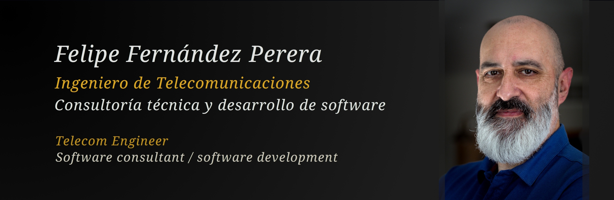
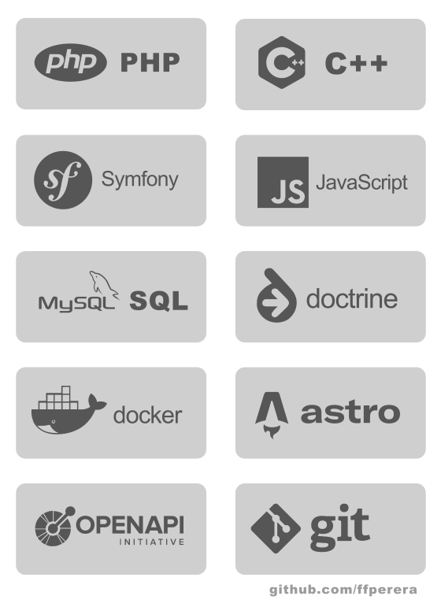

# Felipe Fernández Perera 

¡Hola! 👋

Mi nombre es *Felipe Fernández*. 

Soy ingeniero de telecomunicaciones (ingeniería técnica en **Univ. Alcalá de Henares**, ingeniería superior telecomunicaciones en **Univ. Cantabria**), aunque prácticamente toda mi carrera profesional ha estado relacionada principalmente con el desarrollo de software.   

En 1998 puse en marcha, junto con mi hermano, también teleco, una empresa de **consultoría IT y desarrollo de software**, orientada sobre todo a pequeña y mediana empresa. Para clientes finales y como socios tecnológicos para diferentes consultoras. 

Nos dedicábamos sobre todo a desarrollo backend: automatización, paneles de gestión / backoffice, integración de procesos, integración con APIs externas y APIs propias, desarrollo de plugins para aplicaciones comerciales...

En 2015 decidí centrarme en proyectos propios, relacionados con creación de contenidos, divulgación, SEO, etc. Una actividad que me permitía pasar más tiempo con mi familia y mis hijos pequeños.

En este momento estoy abierto a propuestas y nuevas oportunidades profesionales. Puedes contactar conmigo a través de [mi perfil de linkedin](https://www.linkedin.com/in/felipefernandez/).

## Habilidades / skills

Me encanta aprender cosas nuevas. 

Aprender, investigar, enfrentar un problema técnico hasta encontrar una solución.

En muchos proyectos mi papel ha estado más centrado en la parte de análisis y planificación: elaborar informes técnicos y especificaciones a partir de las necesidades del cliente, planificación del proyecto, seguimiento...

Pero también me gusta programar. 

He programado en muchos lenguajes: C/C++, Java, Python, JavaScript... 

Una gran parte de las aplicaciones y desarrollos han sido en PHP, utilizando nuestros propios frameworks en algunos casos, frameworks genéricos como Symfony en otros, o adaptándonos a la arquitectura del proyecto o del software utilizado en el mismo (*WordPress* y su ecosistema, *PrestaShop*, *Magento*, *Moodle*...)   

Casi siempre he trabajado con equipos pequeños, siguiendo una filosofía de gestión ágil, tanto en el desarrollo de proyectos para el cliente final, como colaborando con otros equipos (consultoras en muchos casos o con el propio equipo técnico del cliente en otros)

## Software

Durante mi actividad en la empresa de desarrollo, creamos varias aplicaciones propias y motores (frameworks) que luego utilizábamos en diferentes proyectos, personalizando y adaptando para cada cliente y necesidad: 

- **ALO**. Un sistema integral de gestión de alojamientos y reservas (para asociaciones de turismo, centrales de reservas online, etc.) que vendimos finalmente.
- **cubo**. Un motor / framework para desarrollo rápido de aplicaciones web primando el rendimiento de la aplicación final.
- **cubic publisher**. Un gestor de contenidos multi-sitio / multi-idioma, anterior a la aparición de wordpress.
- **integra-G**. Un sistema de gestión integral para empresas agroalimentarias que cubría todo el flujo, desde la entrada de materias primas, escandallo, trazabilidad, procesos de producción, almacenaje, empaquetado, venta, facturación... 

          

<!--
**ffperera/ffperera** is a ✨ _special_ ✨ repository because its `README.md` (this file) appears on your GitHub profile.

Here are some ideas to get you started:

- 🔭 I’m currently working on ...
- 🌱 I’m currently learning ...
- 👯 I’m looking to collaborate on ...
- 🤔 I’m looking for help with ...
- 💬 Ask me about ...
- 📫 How to reach me: ...
- 😄 Pronouns: ...
- ⚡ Fun fact: ...
-->
