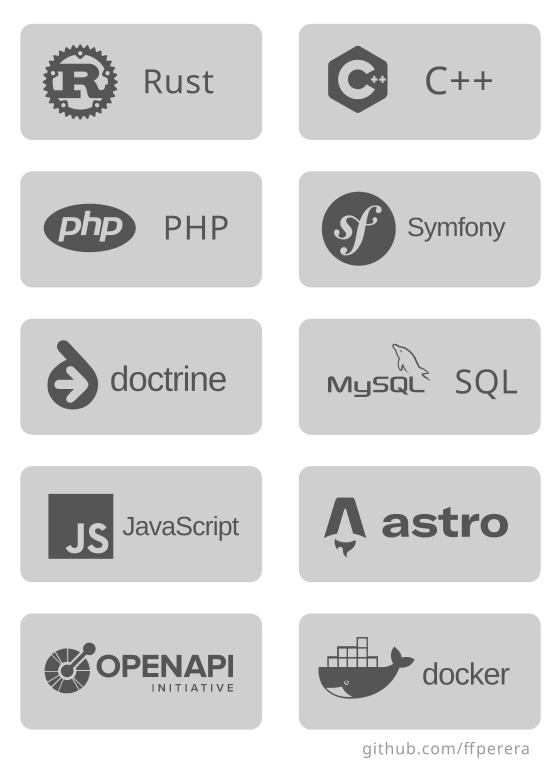
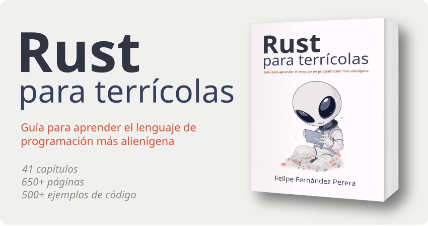

# Felipe Fernández Perera 

Hi! 👋

My name is *Felipe Fernández*.

I am a Telecom Engineer (Bachelor's degree from the University of Alcalá de Henares, Master's degree from the University of Cantabria), although my entire professional career has been dedicated to software development.

In 1998, together with my brother (also a Telecom Engineer), we founded an IT consulting and software development company, primarily focused on small and medium-sized businesses. We worked for end clients and, as technology partners, for various consulting firms, serving clients both nationally (Spain) and internationally.

Our main focus was on backend development: process automation, building backoffices, business process integration, integrating internal and external APIs, and developing plugins for commercial platforms like WordPress and PrestaShop.

In 2015, I decided to pivot towards my own projects, mainly in content creation and SEO. This was an activity that allowed me to spend more time with my kids.

Now, I am open to proposals and new professional opportunities and collaborations. Feel free to reach out through my [LinkedIn profile](https://www.linkedin.com/in/felipefernandez/).

## Skills & Approach

I love learning. I genuinely enjoy diving into new topics, researching, and tackling technical challenges until I find a solution.

In many projects my role has leaned towards analysis and planning: writing technical reports, providing recommendations, drafting technical specifications based on client needs, and project management.

But I also enjoy coding, with a strong focus on software architecture and system design.

I have coded in many languages over the years: C/C++, Java, PHP, Rust, JavaScript, Python... and I'm always eager to add more to the list.

I have worked on a wide range of projects, focusing primarily on backend development with technologies like PHP. My experience includes working with custom in-house frameworks as well as industry standards like Symfony. Additionally, I am experienced in managing and maintaining legacy code inherited from client applications.

Around 2020, I started working with **Rust** as the main language for some side projects, for example tools related to SEO and traffic data analysis. The experience has been fantastic and has even influenced how I approach coding in other languages.

I also enjoy writing about technology. My latest book is a beginner-to-intermediate guide in Spanish for this amazing language: [Rust para terrícolas](https://rustparaterricolas.com/).

Writing it was a great way to deepen my own understanding and share that knowledge.

Beyond tech, I run several blogs on different hobbies, like photography (quecamarareflex.com, quecamaradefotos.com, aprendiendofotografia.com...). Over the years, I've worked extensively with WordPress for these sites, not just as a user, but also developing custom plugins and themes and handling performance optimization. Recently, I've migrated most of them to static-site generators like Astro and Hugo for better performance and a more streamlined workflow.

## Project management & Leadership

I have extensive experience leading small, focused teams, following an agile management philosophy whenever possible. This has been key in delivering projects for end clients and when collaborating with other teams (whether consulting partners or the client's own technical staff).

Some examples of development projects I have led:

- Management systems for accommodations and bookings.
- Management systems for agri-food companies covering the entire process flow: raw material intake, costing, traceability, production, storage, packaging, sales and invoicing.
- Integrations with payment gateways.
- Connecting and synchronizing data via supplier and distributor APIs.
- Building scalable, multi-tenant backoffices and management panels for many web apps.
- Performance optimization deep-dives, including refactoring SQL queries, implementing caching strategies, and improving core algorithms.

