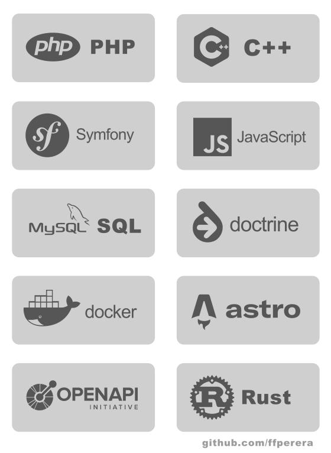

# Felipe Fernández Perera 

Hi! 👋

My name is *Felipe Fernández*. 

I am a telecom engineer (bachelor degree from University of Alcalá de Henares, master degree from University of Cantabria), although my entire professional career has been related to software development.

In 1998, together with my brother, also a telecom engineer, we started an IT consulting and software development company, primarily focused on small and medium-sized businesses. We worked for end clients and, as technology partners, for various consulting firms covering national (Spain) and international clients.

We mainly focused on backend development: automation, backoffices, business process integration, internal and external APIs integration, plugins for commercial applications (WordPress, PrestaShop)...

In 2015, I decided to focus on my own projects, mainly related to content creation and SEO. This was an activity that allowed me to spend more time with my kids.

Now, I am open to proposals and new professional opportunities. You can contact me through [my LinkedIn profile](https://www.linkedin.com/in/felipefernandez/).

## Skills

I love learning.

Learning new things, researching, and tackling a technical problem until I find a solution.

In many projects my role has been more focused on analysis and planning: writing technical reports, recommendations, technical specifications based on the client's needs, project management...

But I also enjoy programming.

I have programmed in many languages: C/C++, Java, PHP, Python, JavaScript, Rust...

Around 90% of the development projects I have been involved in were directly or indirectly related to PHP, mainly on the backend side.

I have experience dealing with legacy code inherited from client's applications. 

We have used our own frameworks in some projects, as well as generic frameworks like [Symfony](https://symfony.com/).

I enjoy writing, and I have several blogs on different topics, for example some of them related to photography and cameras (quecamarareflex.com, quecamaradefotos.com, aprendiendofotografia.com...)

Over the past few years, I have worked extensively with WordPress. As an user and also as developer (plugins, themes, optimization).

Currently, I have migrated most of those blogs to static-site generators like Astro and Hugo, looking for best performance and a better workflow.

## Project management

I have worked with small teams, following an agile management philosophy whenever possible, both in developing projects for end clients and also collaborating with other teams (consulting firms in some cases or the client's own technical team in others).

Some examples of dev projects I have led:

- Management systems for accommodations and bookings.
- Management systems for agri-food companies covering the entire process flow: raw material intake, costing, traceability, production processes, storage, packaging, sales, invoicing...
- Integrations of payment gateways.
- Integrations of suppliers and distributors APIs.
- Multi-tenant backoffices / management panels for many web apps.
- App optimization (SQL, caching strategies, algorithms...)

